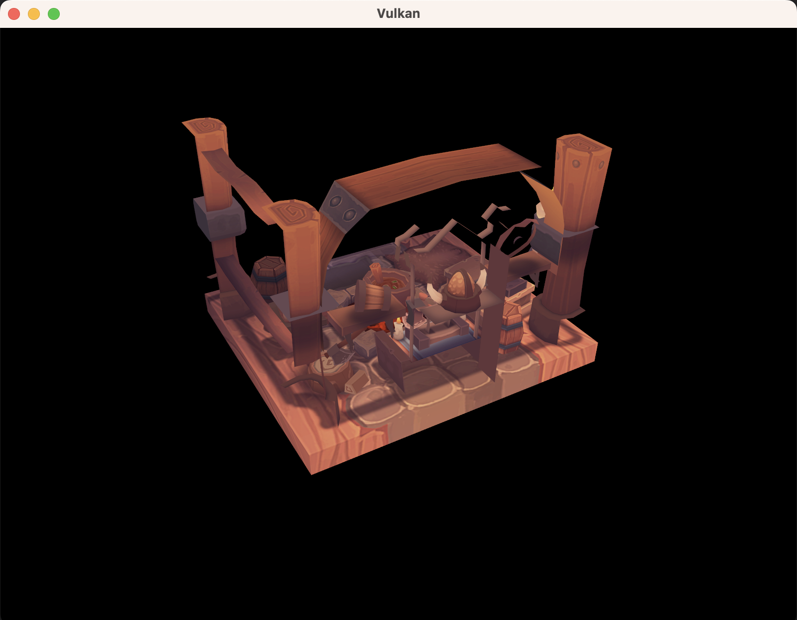
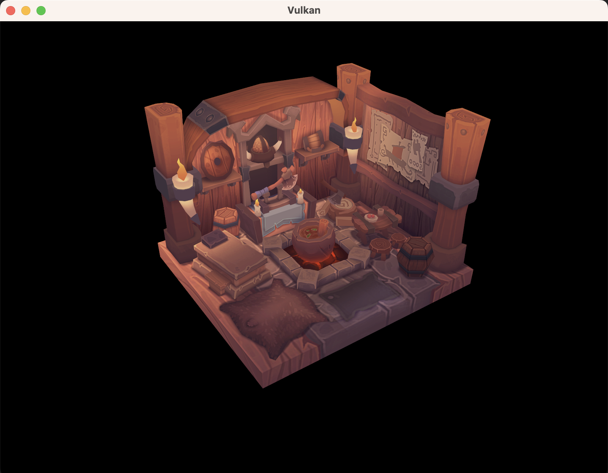

# Introducation

A simple renderer based on Vulkan

# Dependence
> MacOS and Windows
- VulkanSDK
- glfw
- glm
- stb_image
- tiny_obj_loader

# Build
```zsh
git clone https://github.com/liamhauw/vulkan-demo.git
cmake -S . -B build
cmake --build build
```

# Run
```zsh
./bin/main
```

# Result


